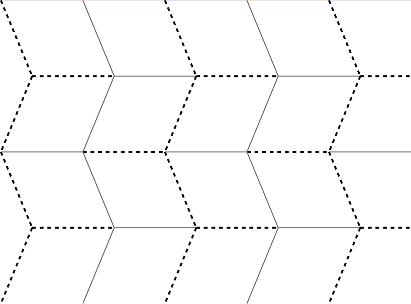

# Python Script: Miura Fold Pattern SVG Generator

## Purpose

This Python script generates a Miura-ori crease pattern in SVG format for printing or further editing. It automatically fits the pattern to user-specified paper dimensions and a compactness factor, handling rhombus sizing and angles without manual calculations.

## What is Miura-ori?

If you're new: Miura-ori is a rigid origami pattern of interlocking parallelograms that folds a flat sheet (like paper or solar panels) into a compact accordion. Invented by Japanese engineer Kōryō Miura in the 1970s, it's famous for efficient packing—think deployable space tech or map-folding hacks. See [Wikipedia](https://en.wikipedia.org/wiki/Miura_fold).

## Output Example

## Requirements

- Python 3.6+

## Commandline Switches

- `--compact`: Compactness factor along the shorter paper edge. Default: 7 (folds to 1/7th of the shorter edge).
- Dimensions: `--mm <h>x<w>`, `--in <h>x<w>`, or `--px <h>x<w>` (default: 816x1056 px for letter portrait).
- `--output`: Specify output file name. Default miura_fold.svg.
- `--folds-dotted`: Render mountain/valley folds as dotted lines (Morse-style for mountains, segment-dash for valleys).
- `--folds-color <color1_hex> <color2_hex>`: Color mountain/valley folds with specified hex codes (e.g., #FF0000 #0000FF). Can be combined with --folds-dotted for dashed variants.

## Usage

**Default generation (letter size, compactness 7, black lines):**

`python miura_fold.py`

*Outputs: `miura_fold.svg`.*

**Custom example (300mm x 400mm, compactness 5, green/magenta dotted folds):**

`python miura_fold.py --compact 5` --mm 300x400 --folds-color #00FF00 #FF00FF --folds-dotted --output custom.svg`
	
*Note: Use tools like Inkscape for post-processing.*

## Code

View source: [miura_fold.py](miura_fold.py)

## License

This Python script is released under the [MIT License](LICENSE).

## About

**X**: [@5ynthaire](https://x.com/5ynthaire)  
**GitHub**: [https://github.com/5ynthaire](https://github.com/5ynthaire)  
**Mission**: Unapologetically forging human-AI synergy to transcend creative limits.  
**Attribution**: Created with Grok by xAI (no affiliation).
